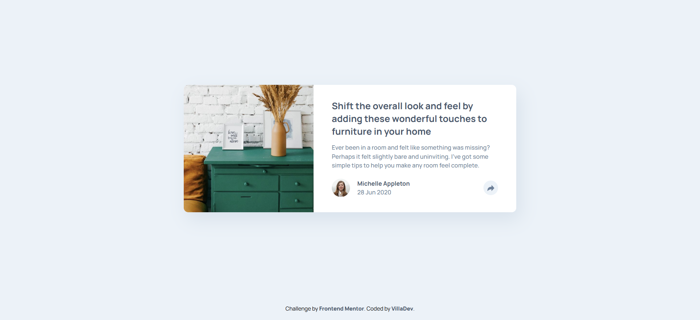

# Frontend Mentor - Article preview component solution

This is a solution to the [Article preview component challenge on Frontend Mentor](https://www.frontendmentor.io/challenges/article-preview-component-dYBN_pYFT). Frontend Mentor challenges help you improve your coding skills by building realistic projects. 

## Table of contents

- [Overview](#overview)
  - [The challenge](#the-challenge)
  - [Screenshot](#screenshot)
  - [Links](#links)
- [My process](#my-process)
  - [Built with](#built-with)
  - [What I learned](#what-i-learned)
  - [Continued development](#continued-development)
  - [Useful resources](#useful-resources)
- [Author](#author)
- [Acknowledgments](#acknowledgments)

## Overview

### The challenge

Users should be able to:

- View the optimal layout for the component depending on their device's screen size
- See the social media share links when they click the share icon

### Screenshot



### Links

- Solution URL: [GitHub repo](https://your-solution-url.com)
- Live Site URL: [Live site URL](https://your-live-site-url.com)

## My process

### Built with

- Semantic HTML5 markup
- CSS custom properties
- Flexbox

### What I learned

This was a interesting challenge where I learned a few tricks I didn't know. It was necessary to implement two different styles for both mobile and desktop design, cause in the given desktop design the share menu is a popup positioned above the share button. On the other hand in the mobile design the share menu is in the bottom of the card and hidding the author avatar and name. So, I decided to hide the autor content when the share button is activated and show the hidden share menu using JavaScript, and by the way I had to bring the share button to front with z-index, so the user can click it again to hide the menu.
There was a second problem at time of positioning the menu in both designs, cause the popup in the desktop design is over the share button as mentioned before, so the popup position should be relative to share button to ensure the correct positioning of that element but in the mobile design the menu's positon was relative to the author_share container, and for that reason I had to change the relative element depending on the screen device size 

Below I show you a little bit of the code used to change the menu visibility and the :

```css
.author__container{
    visibility: visible;
}
.author__container.visibility{
    visibility: visible;
}
.share__button{
    position: relative;
}
.popup{
    position: absolute;
    bottom: 32px;
    left: 50%;
    transform: translate(-50%,-50%);
    visibility: hidden;
    opacity: 0;
    transition: all 0.3s ease;
}
.popup.visible {  
    visibility: visible;
    opacity: 1;
}

@media screen and (max-width: 576px) {
    .author__share{
        padding: 20px 30px;
        position: relative;
    }
    .author__container{
        visibility: visible;
    }
    .author__container.visibility{
        visibility: hidden;
    }
    .share__button{
        position: static;
    }.popup{
        visibility: hidden;
        box-sizing: content-box;
        opacity: 0;
        width: 100%;
        padding: 20px;
        height: 40px;
        left: 0;
        bottom: 0;
        transform: none;
        border-top-right-radius: 0;
        border-top-left-radius: 0;
        z-index: -1;
    }
}
```
```js
shareButton.addEventListener('click', function() {  
    authorContainer.classList.toggle('visibility');
    popup.classList.toggle('visible');  
}); 

```

## Author

- Website - [GitHub profile](https://www.your-site.com)
- Frontend Mentor - [@avfonseca00](https://www.frontendmentor.io/profile/avfonseca00)
- Email - [Gmail](mailto:avfonseca00@gmail.com)
