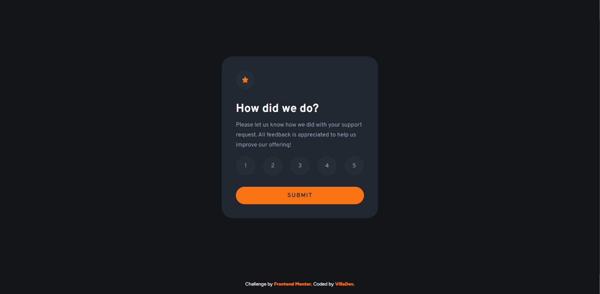

# Frontend Mentor - Interactive rating component solution

This is a solution to the [Interactive rating component challenge on Frontend Mentor](https://www.frontendmentor.io/challenges/interactive-rating-component-koxpeBUmI). Frontend Mentor challenges help you improve your coding skills by building realistic projects. 

## Table of contents

- [Overview](#overview)
  - [The challenge](#the-challenge)
  - [Screenshot](#screenshot)
  - [Links](#links)
- [My process](#my-process)
  - [Built with](#built-with)
  - [What I learned](#what-i-learned)
  - [Useful resources](#useful-resources)
- [Author](#author)

## Overview

### The challenge

Users should be able to:

- View the optimal layout for the app depending on their device's screen size
- See hover states for all interactive elements on the page
- Select and submit a number rating
- See the "Thank you" card state after submitting a rating

### Screenshot



### Links

- Solution URL: [Github repo](https://github.com/avfonseca00/FrontendMentor/tree/main/interactive-rating-component-main)
- Live Site URL: [Live site URL](https://your-live-site-url.com)

## My process

### Built with

- Semantic HTML5 markup
- CSS custom properties
- Flexbox

### What I learned

In this challenge I learned an interesting trick when trying to implement the rating component. I didn't know how to make the user select just one option between the 5 rating elements cause I thought was unable to use a radio button. So I investigated and find out that I can hide the input itself and use its label to show the content using a combinator operator in my css styles, so I'll show you a little bit of my solution:

```html

  <div class="rating">
  <input type="radio" id="star1" name="rating" value="1">  
  <label for="star1">1</label>  
  <input type="radio" id="star2" name="rating" value="2">  
  <label for="star2">2</label>  
  <input type="radio" id="star3" name="rating" value="3">  
  <label for="star3">3</label>
...
```
```css

  input[type="radio"] {  
      display: none;
  } 
  input[type="radio"]:checked + label {  /* Use the + combinator to select the label tag after checked radio*/  
      background-color:var(--white);
      color: var(--dark-blue);
  }
```
```js

    //We could get the active rating element by using this selector
    const rating = document.querySelector('input[name="rating"]:checked'); 
```

### Useful resources

- [CSSNotesForProfessionals](https://goalkicker.com/CSSBook/CSSNotesForProfessionals.pdf) - This helped me for understanding the combinator use. I really liked this pattern and will use it going forward. I highly recommend you this document as it is a very useful resource that resumes the main shorthands, selectors and css properties.

## Author

- Website - [GitHub profile](https://github.com/avfonseca00)
- Frontend Mentor - [@avfonseca00](https://www.frontendmentor.io/profile/avfonseca00)
- Email - [Gmail](mailto:avfonseca00@gmail.com)