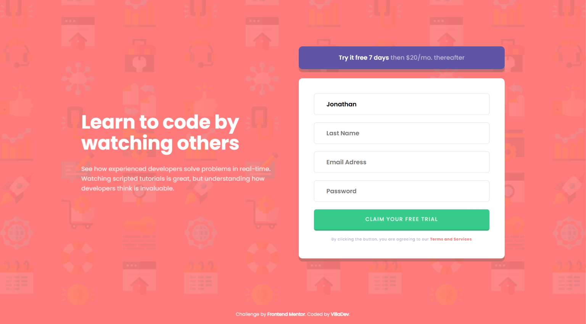

# Frontend Mentor - Intro component with sign up form solution

This is a solution to the [Intro component with sign up form challenge on Frontend Mentor](https://www.frontendmentor.io/challenges/intro-component-with-signup-form-5cf91bd49edda32581d28fd1). Frontend Mentor challenges help you improve your coding skills by building realistic projects. 

## Table of contents

- [Overview](#overview)
  - [The challenge](#the-challenge)
  - [Screenshot](#screenshot)
  - [Links](#links)
- [My process](#my-process)
  - [Built with](#built-with)
  - [What I learned](#what-i-learned)
- [Author](#author)

## Overview

### The challenge

Users should be able to:

- View the optimal layout for the site depending on their device's screen size
- See hover states for all interactive elements on the page
- Receive an error message when the `form` is submitted if:
  - Any `input` field is empty. The message for this error should say *"[Field Name] cannot be empty"*
  - The email address is not formatted correctly (i.e. a correct email address should have this structure: `name@host.tld`). The message for this error should say *"Looks like this is not an email"*

### Screenshot



### Links

- Solution URL: [Github repo](https://github.com/avfonseca00/FrontendMentor/tree/main/intro-component-with-signup-form-master)
- Live Site URL: [Live site URL](https://your-live-site-url.com)

## My process

### Built with

- Semantic HTML5 markup
- CSS custom properties
- Flexbox
- CSS Grid
- Mobile-first workflow

### What I learned

In this challenge I learned how to validate forms using Vanilla JavaScript and also to use regular expressions to validate email fields. In the code below you can see a bit of the code where the email is validated using test function to validate regular expressions:   

```js
function validateEmail(email) {  
    const emailPattern = /^[^\s@]+@[^\s@]+\.[^\s@]+$/; // Patrón del email  
    return emailPattern.test(email);  //Si se cumple el patron se devuelve true
}  
```

## Author

- Website - [GitHub profile](https://github.com/avfonseca00)
- Frontend Mentor - [@avfonseca00](https://www.frontendmentor.io/profile/avfonseca00)
- Email - [Gmail](mailto:avfonseca00@gmail.com)