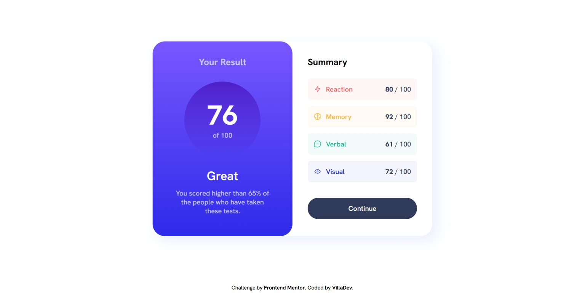

# Frontend Mentor - Results summary component solution

This is a solution to the [Results summary component challenge on Frontend Mentor](https://www.frontendmentor.io/challenges/results-summary-component-CE_K6s0maV). Frontend Mentor challenges help you improve your coding skills by building realistic projects. 

## Table of contents

- [Overview](#overview)
  - [The challenge](#the-challenge)
  - [Screenshot](#screenshot)
  - [Links](#links)
- [My process](#my-process)
  - [Built with](#built-with)
  - [What I learned](#what-i-learned)
  - [Useful resources](#useful-resources)
- [Author](#author)

## Overview

### The challenge

Users should be able to:

- View the optimal layout for the interface depending on their device's screen size
- See hover and focus states for all interactive elements on the page
- **Bonus**: Use the local JSON data to dynamically populate the content

### Screenshot



### Links

- Solution URL: [Github repo](https://github.com/avfonseca00/FrontendMentor/tree/main/results-summary-component-main)
- Live Site URL: [Live site URL](https://your-live-site-url.com)

## My process

### Built with

- Semantic HTML5 markup
- CSS custom properties
- Flexbox
- Mobile-first workflow
- JavaScript

### What I learned

Although it is non something so advanced, I learned how to use the data from a JSON to dynamically populate the content of the page using JavaScript. Something interesting was to manipulate all the elements through it's container using the querySelectorAll this way ```parent.querySelectorAll('.childrenClassName')``` and also use a foreach method instead of the classic for() cycle we're all used to.

Here you can see how to do so:

```html
  <div class="container">
    <div class="player">
      <p class="name"></p>
      <p class="age"></p>
      <p class="score"></p>
    </div>
    <div class="player">
      <p class="name"></p>
      <p class="age"></p>
      <p class="score"></p>
    </div>
    <div class="player">
      <p class="name"></p>
      <p class="age"></p>
      <p class="score"></p>
    </div>
  </div>
```

```js
  const players = [
    {
      "name": "Laura",
      "age": 23,
      "score": 89
    },
    ...
  ]

  const container = document.querySelector('.container');
  const items = container.querySelectorAll('.player');

  items.forEach((item, index) => {
    const player = players[index];

    item.querySelector('.name').textContent = player.name; //The same for the other elements
  });

```

### Useful resources

- [Example resource 1](https://www.goalkicker.com/JavaScriptBook) - This is a useful resource cause we can find information of every JavaScript characteristic very resumed and well explained.

## Author

- Website - [GitHub profile](https://github.com/avfonseca00)
- Frontend Mentor - [@avfonseca00](https://www.frontendmentor.io/profile/avfonseca00)
- Email - [Gmail](mailto:avfonseca00@gmail.com)