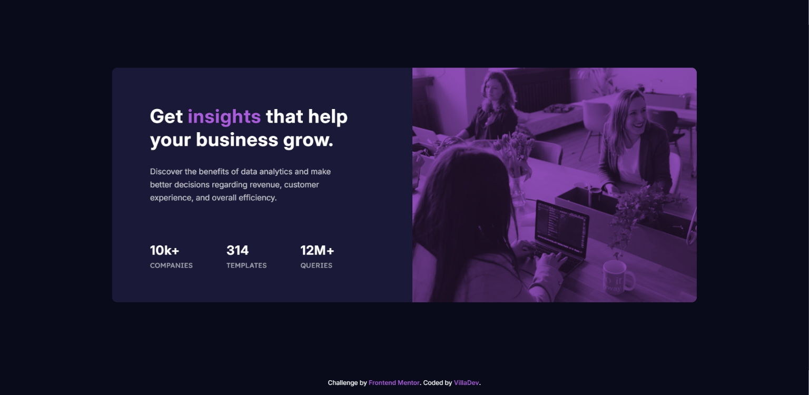

# Frontend Mentor - Stats preview card component solution

This is a solution to the [Stats preview card component challenge on Frontend Mentor](https://www.frontendmentor.io/challenges/stats-preview-card-component-8JqbgoU62). Frontend Mentor challenges help you improve your coding skills by building realistic projects. 

## Table of contents

- [Overview](#overview)
  - [The challenge](#the-challenge)
  - [Screenshot](#screenshot)
  - [Links](#links)
- [My process](#my-process)
  - [Built with](#built-with)
  - [What I learned](#what-i-learned)
- [Author](#author)

## Overview

### The challenge

Users should be able to:

- View the optimal layout depending on their device's screen size

### Screenshot



### Links

- Solution URL: [Github repo](https://github.com/avfonseca00/FrontendMentor/tree/main/stats-preview-card-component-main)
- Live Site URL: [Live site URL](https://your-live-site-url.com)

## My process

### Built with

- Semantic HTML5 markup
- CSS custom properties
- Flexbox
- Mobile-first workflow

### What I learned

In this project it was a challenge how I had to use CSS to achieve the same design result since the image was in grayscale and I had to give it a violet tint, so I used an overlay with the violet tint and then positioned it on top using absolute position.

Here you can see how to achieve this effect using an overlay with mix-blend-mode filter:

```html
<div class="img__container">
  
</div>
```
```css
.img__container {
  position: relative;
  display: inline-block;
}
.img__container::after {
  content: "";
  position: absolute;
  top: 0;
  left: 0;
  width: 100%;
  height: 100%;
  background: hsl(277, 64%, 61%); 
  mix-blend-mode: multiply;
}
.img__container img {
  display: block;
  width: 100%;
  filter: grayscale(100%);
}
```

## Author

- Website - [GitHub profile](https://github.com/avfonseca00)
- Frontend Mentor - [@avfonseca00](https://www.frontendmentor.io/profile/avfonseca00)
- Email - [Gmail](mailto:avfonseca00@gmail.com)
